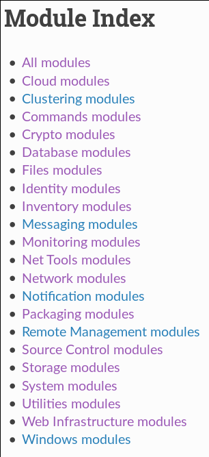

## Tasks

* Specify desired target state (idempotent)
* Run actions on target
* Use ansible modules

```yaml
- name: Run modulename with modulearg=value
  modulename:
    modulearg: value
    modulearg2: value
```


## Modules

`copy`: copy files to the target

```yaml
- copy:
    src: localfile.txt
    dest: /path/to/remotefile.txt
    owner: myuser
    mode: 0755
```


## Modules

`template`: create files on target from Jinja2 template

```yaml
- template:
    src: template.j2
    dest: /path/to/remotefile.txt
    owner: myuser
    mode: 0755
```


## Modules

`apt`: install debian packages

```yaml
- apt:
    name: ansible
    state: present
```


## Modules

`command`: run arbitrary commands on target

```yaml
- command: sed -i somefile "s:foo:bar:g"
  args:
    chdir: /path/to/cwd
```


## ...and a LOT more!

 
